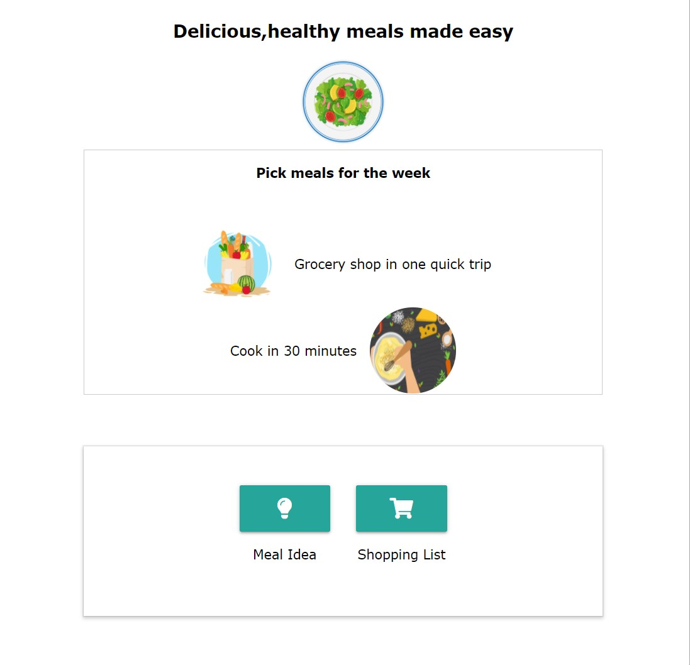
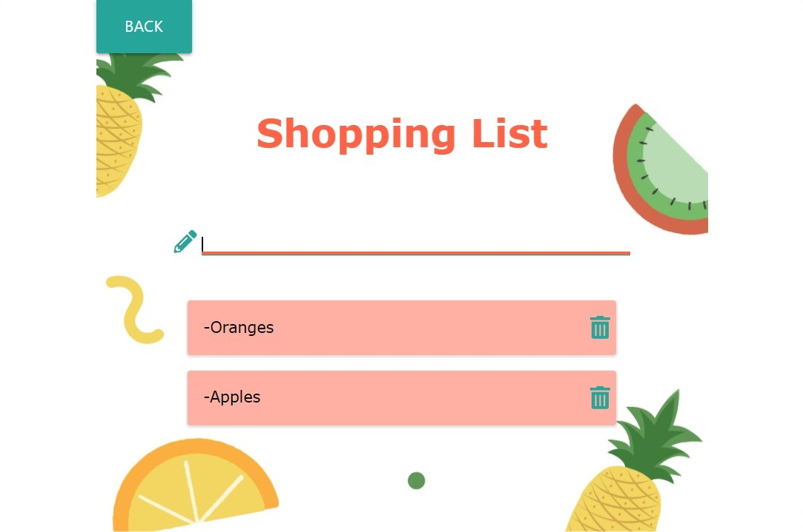
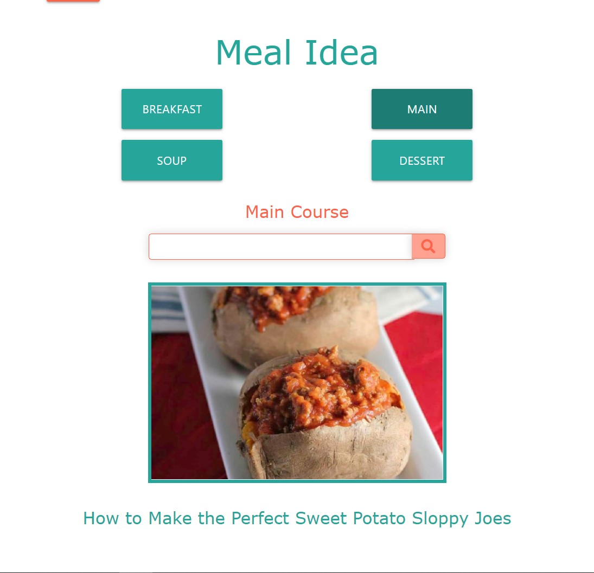
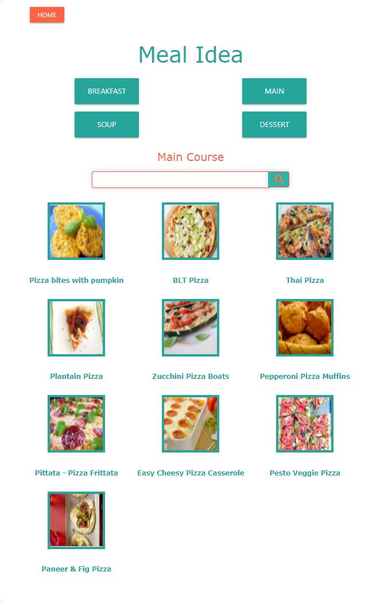
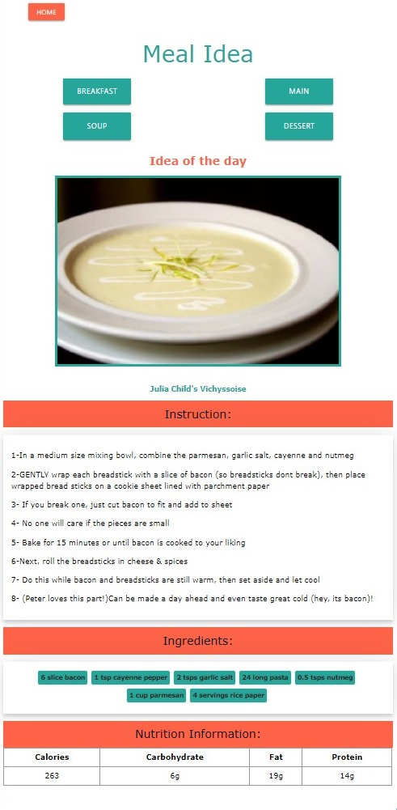

<h1>Meal Finder</h1>

Meal Finder is an application that offers you recipe ideas for your everyday meals along with photos of the finished dish.
Most recipes come with instructions, required ingredients and nutritional facts that include the number of calories per serving.

Meal finder also contains a shopping list to which you can quickly add items for easy shopping the next time you're out.

 
<table><tr><td>
  
  
  
</td></tr></table>

<table><tr><td>
  
  
</td></tr></table>

<h2>App explanation</h2>

There is a meal idea button that gives you a random meal; if the picture intrigues you, you can click and see all information related to the dish.
You can also select your specific meal (breakfast, main course, soup, dessert), search for recipes, and receive all the information such as instructions, ingredients and nutrition information. As a future development, I will add the possibility of saving the user's favourite dishes.

Search and generate random meals from the <a href="https://spoonacular.com/food-api">Spoonacular API</a>

Technology used: HTML5, CSS3, Materialize, JAVASCRIPT, DOM Manipulation, Local Storage, API

